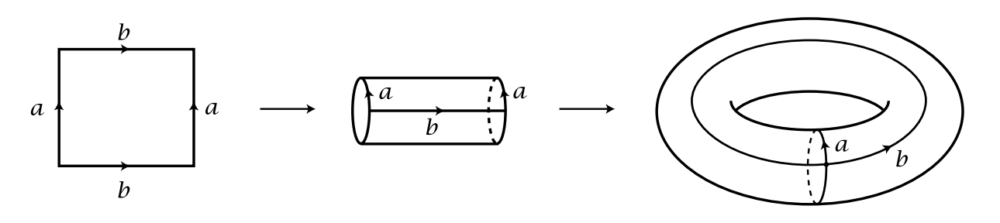
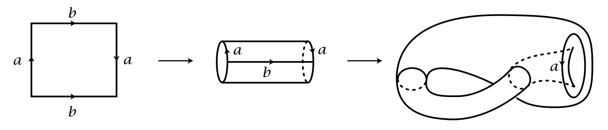
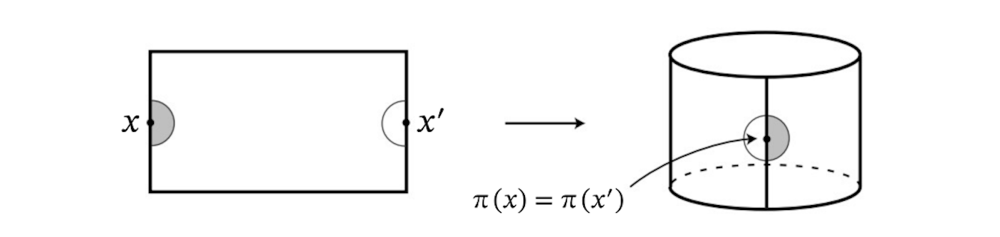
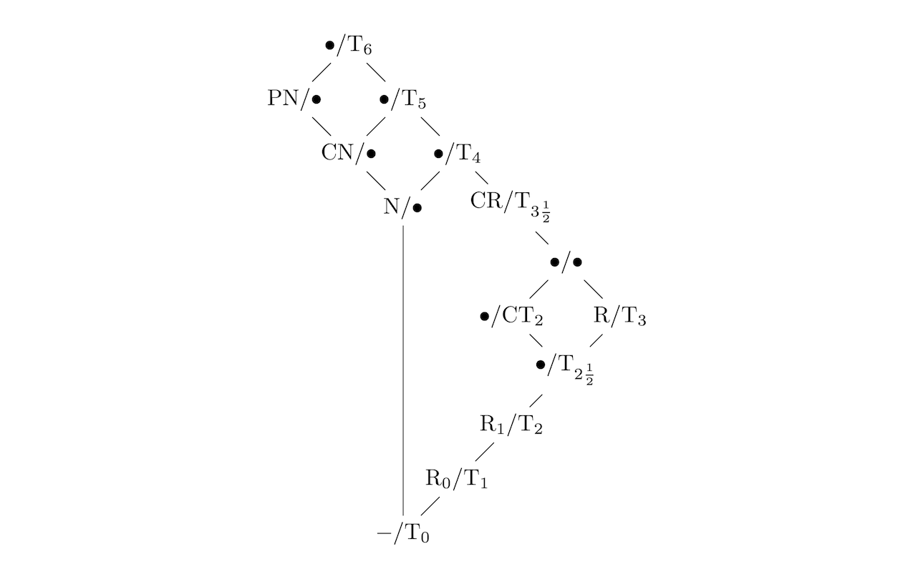

<!-- MITA 数学讲义 -->

# 点集拓扑
### Notes on General Topology

## 目录

- [拓扑空间](#拓扑空间)
    - [定义](#拓扑空间#定义)
    - [拓扑的粗细](#拓扑空间#拓扑的粗细)
    - [拓扑基](#拓扑空间#拓扑基)
    - [闭集](#拓扑空间#闭集)
    - [基本概念](#拓扑空间#基本概念)
    - [内部&闭包](#拓扑空间#内部&闭包)
    - [开/闭映射&连续映射](#拓扑空间#开/闭映射&连续映射)
    - [邻域](#拓扑空间#邻域)
    - [默认拓扑](#拓扑空间#默认拓扑)
        - [子空间](#拓扑空间#默认拓扑#子空间)
        - [积空间](#拓扑空间#默认拓扑#积空间)
        - [商空间](#拓扑空间#默认拓扑#商空间)
        - [默认拓扑的一致性](#拓扑空间#默认拓扑#默认拓扑的一致性)
- [拓扑不变量](#拓扑不变量)
    - [同胚](#拓扑不变量#同胚)
    - [分离性](#拓扑不变量#分离性)
        - [定义](#拓扑不变量#分离性#定义)
        - [判定准则](#拓扑不变量#分离性#判定准则)
        - [特性](#拓扑不变量#分离性#特性)
        - [特殊化序](#拓扑不变量#分离性#特殊化序)
        - [Kolmogorov 商](#拓扑不变量#分离性#Kolmogorov商)
    - [可数性](#拓扑不变量#可数性)
        - [定义](#拓扑不变量#可数性#定义)
        - [判定准则](#拓扑不变量#可数性#判定准则)
        - [特性](#拓扑不变量#可数性#特性)
    - [连通性](#拓扑不变量#连通性)
        - [定义](#拓扑不变量#连通性#定义)
        - [判定准则](#拓扑不变量#连通性#判定准则)
        - [特性](#拓扑不变量#连通性#特性)
    - [连通分支&局部连通性](#拓扑不变量#连通分支&局部连通性)
        - [定义](#拓扑不变量#连通分支&局部连通性#定义)
        - [判定准则](#拓扑不变量#连通分支&局部连通性#判定准则)
        - [特性](#拓扑不变量#连通分支&局部连通性#特性)
    - [紧致性](#拓扑不变量#紧致性)
        - [定义](#拓扑不变量#紧致性#定义)
        - [判定准则](#拓扑不变量#紧致性#判定准则)
        - [特性](#拓扑不变量#紧致性#特性)
    - [局部紧致性](#拓扑不变量#局部紧致性)
        - [定义](#拓扑不变量#局部紧致性#定义)
        - [判定准则](#拓扑不变量#局部紧致性#判定准则)
        - [特性](#拓扑不变量#局部紧致性#特性)
- [度量空间](#度量空间)
    - [定义](#度量空间#定义)
    - [诱导拓扑空间](#度量空间#诱导拓扑空间)
    - [默认拓扑的一致性](#度量空间#默认拓扑的一致性)
    - [完备性](#度量空间#完备性)
- [$\mathbf{R}^{n}$ 上的拓扑](#R^n上的拓扑)
    - [通常拓扑](#R^n上的拓扑#通常拓扑)
    - [上/下限拓扑 ( Sorgenfrey 直线 )](#R^n上的拓扑#上/下限拓扑(Sorgenfrey直线))
    - [K-拓扑](#R^n上的拓扑#K-拓扑)
- [补充](#补充)
- [参考资料](#参考资料)

## 拓扑空间 {#拓扑空间}

### 定义 {#拓扑空间#定义}

**定义（拓扑空间）**
设 $X$ 是集合, 称 $\tau\subseteq2^{X}$ 是 $X$ 上的**拓扑**并且 $(X,\tau)$ 构成**拓扑空间**, 当且仅当 $\tau$ 同时具有

- 非空性: $$\varnothing,X\in\tau\ ;$$
- 并封闭性: $$\forall\ U\subseteq\tau\quad:\quad\bigcup_{A\in U}A\in\tau\ ;$$
- 有限交封闭性: $$\forall\ A_{1},\cdots,A_{n}\in\tau\quad:\quad\bigcap_{k=1}^{n}A_{k}\in\tau\ .$$

拓扑 $\tau$ 中的元素称为拓扑空间 $(X,\tau)$ 中的**开集**.

**推论（平凡拓扑&离散拓扑）**
设 $X$ 是集合, $X$ 上的**平凡拓扑** $\{\varnothing,X\}$ 和**离散拓扑** $2^{X}$ 都是 $X$ 上的拓扑.

**「拓扑空间」的预设**

- 设 $(X,\tau)$ , $(Y,\tau')$ , $(Z,\tau'')$ 是拓扑空间.

在不引发歧义的情况下, 一般我们用集合符号 $X$ 来代表拓扑空间 $(X,\tau)$ .

称某个拓扑空间 $(X,\tau)$ 是**非空**的, 当且仅当 $X$ 是非空的.

---

### 拓扑的粗细 {#拓扑空间#拓扑的粗细}

**定义（拓扑的粗细）**
设 $(X,\tau_{1}),(X,\tau_{2})$ 是拓扑空间, 称 $\tau_{1}$ **粗**于 $\tau_{2}$ 或 $\tau_{2}$ **细**于 $\tau_{1}$ , 当且仅当 $\tau_{1}\subseteq\tau_{2}$ .

**推论（最粗/最细拓扑）**
设 $X$ 是集合,

- $X$ 上的平凡拓扑 $\{\varnothing,X\}$ 粗于 $X$ 上的任何拓扑.
- $X$ 上的离散拓扑 $2^{X}$ 细于 $X$ 上的任何拓扑.

---

### 拓扑基 {#拓扑空间#拓扑基}

拓扑基给出了一种在集合 $X$ 上构建拓扑的简单方式.

**定义（基）**
设 $X$ 是集合, 称 $\mathcal{B}\subseteq2^{X}$ 是 $X$ 上的**基**, 当且仅当同时具有

- 覆盖性: $$X=\bigcup_{A\in\mathcal{B}}A\ ;$$
- 有限交封闭性: $$\forall\ B_{1},B_{2}\in\mathcal{B}\quad:\quad B_{1}\cap B_{2}\in\left\{\bigcup_{A\in\mathcal{B}'}A\ \bigg|\ \mathcal{B}'\subseteq\mathcal{B}\right\}\ .$$

**定理（基生成拓扑）**
设 $X$ 是集合, 若 $\mathcal{B}\subseteq2^{X}$ 是 $X$ 上的基, 则 $\mathcal{B}$ 生成的拓扑 $$\tau_{\mathcal{B}}:=\left\{\bigcup_{A\in\mathcal{B}'}A\ \bigg|\ \mathcal{B}'\subseteq\mathcal{B}\right\}$$ 是 $X$ 上的拓扑.

**证明**
分别取 $\mathcal{B}'=\varnothing$ 和 $\mathcal{B}'=\mathcal{B}$ , 立即得 $\varnothing\in\tau_{\mathcal{B}}$ 和 $X\in\tau_{\mathcal{B}}$ .
对任意 $A_{1},A_{2}\in\tau_{\mathcal{B}}$ , 分别存在 $\mathcal{B}'_{1},\mathcal{B}'_{2}\subseteq\mathcal{B}$ 使得 $A_{1}=\bigcup_{A\in\mathcal{B}'_{1}}$ 和 $A_{2}=\bigcup_{A\in\mathcal{B}'_{2}}$ , 于是

由此称 $\mathcal{B}$ 为 $\tau_{\mathcal{B}}$ 的基.

**定义（子基）**
设 $X$ 是集合, 称 $\mathcal{S}\subseteq2^{X}$ 是 $X$ 上的**子基**, 当且仅当其具有

- 覆盖性: $$X=\bigcup_{A\in\mathcal{S}}A\ .$$

**定理（子基生成基）**
设 $X$ 是集合, 若 $\mathcal{S}\subseteq2^{X}$ 是 $X$ 上的子基, 则 $\mathcal{S}$ 生成的基 $$\mathcal{B}_{\mathcal{S}}=\left\{\bigcap_{k=1}^{n}A_{k}\ \bigg|\ A_{1},\cdots,A_{n}\in\mathcal{S}\right\}$$ 是 $X$ 上的基.

由此称 $\mathcal{S}$ 为 $\mathcal{B}_{\mathcal{S}}$ 的子基和 $\tau_{\mathcal{B}_{\mathcal{S}}}$ 的子基, 并且称 $\tau_{\mathcal{B}_{\mathcal{S}}}$ 为 $\mathcal{S}$ 生成的拓扑.

**定理（子基的性质）**
设 $\mathcal{S}\subseteq2^{X}$ 是 $\tau$ 的子基, 则

- $\tau$ 是 $X$ 上包含 $\mathcal{S}$ 的最粗拓扑.

---

### 闭集 {#拓扑空间#闭集}

开集可以导出与之对偶的概念.

**定义（闭集）**
设 $A\subseteq X$ , 称 $A$ 是**闭集**当且仅当 $X\setminus A$ 是开集.

**推论（平凡闭集）**
$\varnothing$ 和 $X$ 是闭集.

> 注意到开集和闭集的概念是互补等价的, 即我们可以用闭集来定义拓扑, 即需满足下面三则性质:
>
> - 非空性: $$\varnothing,X\in\tau\ ;$$
> - 交封闭性: $$\forall\ U\subseteq\tau\quad:\quad\bigcap_{A\in U}A\in\tau\ ;$$
> - 有限并封闭性: $$\forall\ A_{1},\cdots,A_{n}\in\tau\quad:\quad\bigcup_{k=1}^{n}A_{k}\in\tau\ .$$
>
> 此时 $\varnothing$ 和 $X$ 是开集则作为该定义下的推论.

---

### 基本概念 {#拓扑空间#基本概念}

**定义（点）**
设 $A\subseteq X$ ,

- 称 $x\in X$ 是 $A$ 的**内点**, 当且仅当存在开集 $O$ 使得 $x\in O$ 且 $O\subseteq A$ .
- 称 $x\in X$ 是 $A$ 的**外点**, 当且仅当 $x$ 是 $X\setminus A$ 的内点.
- 称 $x\in X$ 是 $A$ 的**边界点**, 当且仅当对任意满足 $x\in O$ 的开集 $O$ 都有 $O\cap A\ne\varnothing$ 和 $O\cap(X\setminus A)\ne\varnothing$ .
- 称 $x\in X$ 是 $A$ 的**极限点**, 当且仅当对任意满足 $x\in O$ 的开集 $O$ 都有 $(O\cap A)\setminus\{x\}\ne\varnothing$ .
- 称 $x\in X$ 是 $A$ 的**孤立点**, 当且仅当 $x\in A$ 且 $x$ 不是 $A$ 的极限点.

**推论（点的三歧性）**
对任意 $A\subseteq X$ 和 $x\in X$ , 有且仅有下述一则成立:

- $x$ 是 $A$ 的内点.
- $x$ 是 $X\setminus A$ 的内点.
- $x$ 是 $A$ 的边界点.

**定义（点集）**
设 $A\subseteq X$ , 则

- $A$ 的**边界**定义为其全体边界点构成的集合, 记作 $\partial A$ .
- $A$ 的**内部**定义为其全体内点构成的集合, 记作 $\operatorname{int} A$ .
- $A$ 的**导集**定义为其全体极限点构成的集合, 记作 $A'$ .
- $A$ 的**闭包**定义为 $\overline{A}:=A\cup A'$ .

从直观上看, 集合的闭包是由所有与该集合或该集合中的点不可分离的点所构成的.

**定理（点集的开闭性）**
设 $A\subseteq X$ , 则

- $\partial A$ 是闭集.
- $\operatorname{int}A$ 是全体包含于 $A$ 的开集的并集.
- $\overline{A}$ 是全体包含 $A$ 的闭集的交集.

**定理（空间的划分）**
设 $A\subseteq X$ , 则 $$X=\operatorname{int}A\sqcup\operatorname{int}(X\setminus A)\sqcup\partial A\ .$$

**定理（开集&闭集的等价条件）**
设 $A\subseteq X$ , 则

- $A$ 是开集当且仅当 $A$ 的所有点都是内点.
- $A$ 是闭集当且仅当 $A$ 的所有极限点都属于 $A$ .
- $A$ 是开集当且仅当 $A=\operatorname{int}A$ .
- $A$ 是闭集当且仅当 $A=\overline{A}$ .

**定义（稠密集）**
设 $A\subseteq X$ , 称 $A$ 在拓扑空间 $X$ 中**稠密**, 当且仅当 $\overline{A}=X$ .

---

### 内部&闭包 {#拓扑空间#内部&闭包}

**定理（内部与闭包的单调性）**
设 $A,B\subseteq X$ , 若 $A\subseteq B$ , 则

- $$\operatorname{int}A\subseteq\operatorname{int}B\ .$$
- $$\overline{A}\subseteq\overline{B}\ .$$

**证明**

- 对任意 $x\in\operatorname{int}A$ , 由内点的定义知存在开集 $O$ 使得 $x\in O$ 且 $O\subseteq A$ , 此时同样有 $O\subseteq B$ , 因此 $x$ 也是 $B$ 中的内点, 即 $x\in\operatorname{int}B$ . 这就证明了 $\operatorname{int}A\subseteq\operatorname{int}B$ .
- 对任意

**定理（内部与闭包的对偶性）**
设 $A\subseteq X$ , 则

- $$\operatorname{int}A=X\setminus\overline{(X\setminus A)}\ .$$
- $$\overline{A}=X\setminus\operatorname{int}(X\setminus A)\ .$$

**定理（内部&闭包的幂等性）**
设 $A\subseteq X$ , 则

- $$\operatorname{int}A=\operatorname{int}(\operatorname{int}A)\ .$$
- $$\overline{A}=\overline{\overline{A}}\ .$$

**定理（内部&闭包的分配律）**
设 $A,B\subseteq X$ , 则

- $$\operatorname{int}(A\cap B)=\operatorname{int}A\cap\operatorname{int}B\ .$$
- $$\overline{A\cup B}=\overline{A}\cup\overline{B}\ .$$

---

### 开/闭映射&连续映射 {#拓扑空间#开/闭映射&连续映射}

使用下面将给出的定义的前提是我们在 $X$ 和 $Y$ 上选取了默认拓扑, 即作为显式声明的拓扑或被选取了默认拓扑的集合的子拓扑/积拓扑.

**定义（开/闭映射）**
称 $f:X\to Y$ 是**开/闭**的, 当且仅当对任意 $X$ 中的开/闭集 $A$ , $f(A)$ 都是 $Y$ 中的开/闭集, 即 $$\forall\ A\subseteq X\quad:\quad A\in\tau_{X}\implies f(A)\in\tau_{Y}\ .$$

**推论（开双射$\iff$闭双射）**
对任意双射 $f$ , $f$ 是开的当且仅当 $f$ 是闭的.

对于连续映射 $f$ , 我们没有类似的结论.

**定义（连续映射）**
称 $f:X\to Y$ 是**连续**的, 当且仅当对任意 $Y$ 中的开集 $A$ , $f^{-1}(A)$ 都是 $X$ 中的开集, 即 $$\forall\ A\subseteq Y\quad:\quad A\in\tau_{Y}\implies f^{-1}(A)\in\tau_{X}\ .$$

**推论（特殊的连续映射）**

- 恒等映射 $f:X\to X,x\mapsto x$ 是连续的.
- 常映射 $f:X\to Y,x\mapsto y$ 是连续的, 其中 $y\in Y$ .

**定理（连续映射的等价条件）**
设 $X,Y$ 是拓扑空间, 则 $f:X\to Y$ 是连续的当且仅当
- 对任意 $Y$ 中的闭集 $A$ , $f^{-1}(A)$ 都是 $X$ 中的闭集, 即 $$\forall\ A\subseteq Y\quad:\quad A\in\{Y-A\ |\ A\in\tau_{Y}\}\implies f^{-1}(A)\in\{X-A\ |\ A\in\tau_{X}\}\ .$$
- 对任意 $\mathcal{B}$ 中的开集 $A$ , $f^{-1}(A)$ 都是 $X$ 中的闭集, 即 $$\forall\ A\subseteq Y\quad:\quad A\in\mathcal{B}\implies f^{-1}(A)\in\tau_{X}\ ,$$ 其中 $\mathcal{B}$ 是 $\tau_{Y}$ 的基.

**定理（连续映射的复合）**
若 $f:X\to Y$ 和 $g:Y\to Z$ 是连续的, 则 $g\circ f:X\to Z$ 是连续的.

---

### 邻域 {#拓扑空间#邻域}

**定义（邻域）**
设 $x\in X$ , $A\subseteq X$ , 称

- $U\subseteq X$ 是 $x$ 的**邻域**当且仅当 $x\in\operatorname{int}U$ .
- $U\subseteq X$ 是 $A$ 的**邻域**当且仅当 $A\subseteq\operatorname{int}U$ .

$x$ 和 $A$ 的全体邻域构成的集合分别称为其**邻域系**.

**推论（邻域的等价性）**
设 $x\in X$ , 则 $U$ 是 $x$ 的邻域当且仅当 $U$ 是 $\{x\}$ 的邻域.

**定义（邻域基）**
设 $x\in X$ 并且 $\mathcal{B}$ 是 $x$ 的邻域系的子集, 称 $\mathcal{B}$ 是 $x$ 的**邻域基**当且仅当对 $x$ 的任意邻域 $N$ , 都存在 $B\in\mathcal{B}$ 使得 $B\subseteq N$ .

---

### 默认拓扑 {#拓扑空间#默认拓扑}

一般来说, 我们不会对同一集合同时选取多个不同的拓扑, 因此保证所有被讨论的集合都自动拥有唯一确定的拓扑是有必要的. 作为基本的集合来源, 下面我们将关注拓扑空间的子空间/积空间/商空间上的拓扑结构.

#### 子空间 {#拓扑空间#默认拓扑#子空间}

**定义（子拓扑）**
$A\subseteq X$ 上的**子拓扑**定义为 $$\{A\cap B\ |\ B\in\tau\}\ .$$

**推论（子空间）**
设 $A\subseteq X$ , 则 $X$ 的子空间 $(A,\tau_{A})$ 是拓扑空间, 其中 $\tau_{A}$ 是 $A$ 上的子拓扑.

**推论（自身作为子空间）**
$$\tau=\tau_{X}\ ,$$ 其中 $\tau_{X}$ 是 $X$ 自身上的子拓扑.

**定理（子拓扑的性质）**
设 $A\subseteq X$ , 则

- $\tau_{A}$ 是 $A$ 上使得嵌入映射 $i:A\to X,x\mapsto x$ 连续的最粗拓扑.
- $\tau_{A}$ 是 $A$ 上使得对任意连续映射 $f:X\to Y$ 都有 $f\big|_{A}:A\to Y$ 连续的最粗拓扑.

#### 积空间 {#拓扑空间#默认拓扑#积空间}

**定义（箱拓扑）**
设对任意指标 $i\in I$ , $(X_{i},\tau_{i})$ 都是拓扑空间, 则 $\prod_{i\in I}X_{i}$ 上的**箱拓扑**定义为基 $$\left\{\prod_{i\in I}U_{i}\ \bigg|\ U_{i}\in\tau_{i}\right\}$$ 生成的拓扑.

**推论（箱拓扑是拓扑）**
设对任意指标 $i\in I$ , $X_{i}$ 都是拓扑空间, 则 $\prod_{i\in I}X_{i}$ 上的箱拓扑是 $\prod_{i\in I}X_{i}$ 上的拓扑.

箱拓扑可以为拓扑空间 $X$ 的任何子集的笛卡尔积提供简单的拓扑结构, 但其在许多性质上往往不够理想, 因为其冗余地包含了由“原子开集”的无限交, 这就促使我们在该笛卡尔积上探究更粗的拓扑——积拓扑.

**定义（积拓扑）**
设对任意指标 $i\in I$ , $(X_{i},\tau_{i})$ 都是拓扑空间, 则 $\prod_{i\in I}X_{i}$ 上的**积拓扑**定义为子基 $$\left\{p_{i}^{-1}(A_{i})\ |\ i\in I,A_{i}\in\tau_{i}\right\}$$ 生成的拓扑, 其中 $p_{i}$ 为指标 $i$ 的投影拓扑, 也即基 $$\left\{\prod_{i\in I}A_{i}\ \bigg|\ \forall\ i\in I:A_{i}\in\tau_{i}\ ,\ \#\{i\in I\ |\ A_{i}\subset X_{i}\}<+\infty\right\}$$ 生成的拓扑.

**推论（积空间）**
设对任意指标 $i\in I$ , $X_{i}$ 都是拓扑空间, 则 $\prod_{i\in I}X_{i}$ 的积空间 $$\left(\prod_{i\in I}X_{i},\tau_{I}\right)$$ 是拓扑空间, 其中 $\tau_{I}$ 为 $\prod_{i\in I}X_{i}$ 上的积拓扑.

**定理（积拓扑的性质）**
设 $W$ 是拓扑空间, 并且对任意指标 $i\in I$ , $X_{i}$ 是拓扑空间, 设 $\tau_{I}$ 为 $\prod_{i\in I}X_{i}$ 上的积拓扑, 并记 $$p_{i}:\prod_{j\in I}X_{j}\to X_{i}$$ 表示指标 $i$ 的投影映射, 则

- $\tau_{I}$ 是 $\prod_{i\in I}X_{i}$ 上使得对任何 $i\in I$ 都有 $p_{i}$ 连续的最粗拓扑.
- $\tau_{I}$ 是 $\prod_{i\in I}X_{i}$ 上使得 $f:W\to\prod_{i\in I}X_{i}$ 连续等价于对任意 $i\in I$ 都有 $p_{i}\circ f$ 连续的最细拓扑.

#### 商空间 {#拓扑空间#默认拓扑#商空间}

通过扩展相等关系为新的等价关系, 并依据原有拓扑为其对应的商集赋予新的拓扑结构, 可以实现对拓扑空间的“粘连”.

> 例如, 对实心矩形采用不同的“粘连”可以分别得到**环面**和 **Klein 瓶**, 其中 Klein 瓶不与 $\mathbf{R}^{3}$ 的任何子空间同胚. 具体的“粘连”如图所示: 

**定义（商拓扑）**
$X$ 在等价关系 $\sim$ 下的商集 $\widetilde{X}$ 上的**商拓扑**定义为 $$\left\{A\subseteq\widetilde{X}\ |\ \pi^{-1}(A)\in\tau\right\}\ ,$$ 其中 $\pi:X\to\widetilde{X}$ 表示商映射.

**推论（商空间）**
$X$ 的商空间 $(\widetilde{X},\tau_{\sim})$ 是拓扑空间, 其中 $\widetilde{X}$ 为 $X$ 在等价关系 $\sim$ 下的商集, $\tau_{\sim}$ 是 $\widetilde{X}$ 上的商拓扑.

**定理（商拓扑的性质）**
设 $\tau_{\sim}$ 为 $X$ 的商集 $\widetilde{X}$ 上的商拓扑, 并令 $\pi:X\to\widetilde{X}$ 表示商映射, 则

- $\tau_{\sim}$ 是 $\widetilde{X}$ 上使得 $\pi$ 连续的最细拓扑.
- $\pi$ 是开的当且仅当 $$\forall\ A\in\tau\quad:\quad\bigcup_{x\in A}\pi(x)\in\tau\ .$$
- $f:\widetilde{X}\to Y$ 是连续的当且仅当 $f\circ\pi:X\to Y$ 是连续的.

> 需要注意的是, 对于 $X$ 中的开集 $A$ , $f(A)$ 不一定为商空间 $\widetilde{X}$ 中的开集, 除非有 $A=f^{-1}(f(A))$ 成立. 例如下图中 $\pi(x)$ 的邻域同时对应着 $X$ 中 $x$ 和 $x'$ 的邻域, 只有当此二者同时为开集时 $\pi(x)$ 的邻域才是开的.
> 

> 下面是三种将球面 $S^{2}$ 考虑为闭圆盘 $D^{2}$ 的商空间的方式.
> 第一种是将两个闭圆盘 $D^{2}$ 的边界等同起来, 即在空间 $X=D^{2}\times\{0,1\}$ 中规定 $$\forall\ x\in\partial X\quad:\quad(x,0)\sim(x,1)\ .$$ .png)
>
> 第二种是将闭圆盘的边界分为两个部分, 并将其等同起来, 即在空间 $X=\{(r\cos\theta,r\sin\theta)\ |\ r\in[0,R],\theta\in\mathbf{R}\}$ 中规定 $$\forall\ \theta\in\mathbf{R}\quad:\quad(R\cos\theta,R\sin\theta)\sim(R\cos\theta,-R\sin\theta)\ .$$ 这里我们假设 $D^{2}$ 是圆心为 $(0,0)$ , 半径为 $R$ 的闭圆盘. .png)
>
> 第三种是将整个闭圆盘的边界 $\partial D^{2}$ 等同为同一点, 即在空间 $X=D^{2}$ 中规定 $$\forall\ x,y\in\partial X\quad:\quad x\sim y\ .$$ 这与上面两种方式相比不同之处在于 $\widetilde{X}$ 中的某个等价类是无限集. .png)

#### 默认拓扑的一致性 {#拓扑空间#默认拓扑#默认拓扑的一致性}

除已经显式声明的拓扑空间外, 大多数需要赋予拓扑结构以形成拓扑空间的集合都可视为这些已声明集合的子集/积/商集. 一般地, 当它们被视为拓扑空间时, 将分别以子拓扑/积拓扑/商拓扑作为默认拓扑.

下面的定理保证了作为相同的集合, 子集的积和积的子集也具有相同的默认拓扑, 从而这些拓扑空间所选取的拓扑都是明确的.

**定理（子空间的积拓扑$\iff$积空间的子拓扑）**

---

---

## 拓扑不变量 {#拓扑不变量}

我们即将给出拓扑空间之间同胚的概念, 当两个拓扑空间同胚时, 它们的某些性质必定相同, 这些性质统称为**拓扑不变量**.

我们将省略对集合的拓扑性质定义, 对于子集 $A\subseteq X$ , 我们默认定义 $A$ 具有某个拓扑性质当且仅当 $X$ 的子空间 $A$ 具有该拓扑性质.

### 同胚 {#拓扑不变量#同胚}

**定义（同胚映射）**
称双射 $f:X\to Y$ 为**同胚映射**, 当且仅当 $f$ 和 $f^{-1}$ 是连续的.

**推论（同胚映射的性质）**

- 恒等映射 $f:X\to X,x\mapsto x$ 是同胚映射.
- 若 $f:X\to Y$ 是同胚映射, 则 $f^{-1}:Y\to X$ 是同胚映射.
- 若 $f:X\to Y$ 和 $g:Y\to Z$ 是同胚映射, 则 $g\circ f:X\to Z$ 是同胚映射.

**定义（同胚关系）**
称拓扑空间 $X$ 与 $Y$ **同胚**并记作 $X\cong Y$ , 当且仅当存在某个同胚映射 $f:X\to Y$ .

**推论（同胚关系是等价关系）**

- $X\cong X$ .
- $X\cong Y\iff Y\cong X$ .
- $X\cong Y$ 且 $Y\cong Z$ $\implies X\cong Z$ .

---

### 分离性 {#拓扑不变量#分离性}

下面我们给出拓扑空间各种分离性的定义. 无论如何, 拓扑空间的分离性表明若两个点在较弱（集合）的意义下是可分离（不同）的, 那么其在更强（拓扑）的意义下也是可分离的.

#### 定义 {#拓扑不变量#分离性#定义}

**定义（集合的分离性）**
设 $A,B\subseteq X$ , 称 $A$ 与 $B$ 是

- **拓扑可区分**的, 当且仅当 $A$ 与 $B$ 的邻域系不同.
- **可分离**的, 当且仅当 $A\cap\overline{B}=\varnothing$ 且 $\overline{A}\cap B=\varnothing$ .
- **邻域可分离**的, 当且仅当存在 $A$ 的邻域 $U_{A}$ 和 $B$ 的邻域 $U_{B}$ 使得 $U_{A}\cap U_{B}=\varnothing$ .
- **闭邻域可分离**的, 当且仅当存在 $A$ 的闭邻域 $U_{A}$ 和 $B$ 的闭邻域 $U_{B}$ 使得 $U_{A}\cap U_{B}=\varnothing$ .
- **函数可分离**的, 当且仅当存在连续映射 $f:X\to\mathbf{R}$ 使得 $f(A)=\{0\}$ 且 $f(B)=\{1\}$ .
- **函数完全分离**的, 当且仅当存在连续映射 $f:X\to\mathbf{R}$ 使得 $f^{-1}(\{0\})=A$ 且 $f^{-1}(\{1\})=B$ .

我们可以直接用单元素集的分离性来定义点的分离性, 即

**定义（分离性）**
称拓扑空间 $X$ 是

- **T~0~** 的或 **Kolmogorov** 的, 当且仅当
    - 点与点 拓扑可区分: 对任意不同的 $x,y\in X$ , $x$ 与 $y$ 的邻域系不同, 即存在 $x$ 的邻域 $U_{x}$ 使得 $y\notin U_{x}$ 或存在 $y$ 的邻域 $U_{y}$ 使得 $x\notin U_{y}$ .
- **R~0~** 的, 当且仅当
    - 点与点 拓扑可区分 $\!\!\implies\!\!$ 点与点 可分离: 对任意 $x,y\in X$ , 若 $x$ 与 $y$ 的邻域系不同, 则 $x$ 与 $y$ 的邻域系互不包含, 即
        - 存在 $x$ 的邻域 $U_{x}$ 使得 $y\notin U_{x}$ $\iff$ 存在 $y$ 的邻域 $U_{y}$ 使得 $x\notin U_{y}$ .
- **T~1~** 的或 **Fréchet 的**, 当且仅当
    - 点与点 可分离: 对任意不同的 $x,y\in X$ , $x$ 与 $y$ 的邻域系互不包含, 即存在 $x$ 的邻域 $U_{x}$ 使得 $y\notin U_{x}$ 且存在 $y$ 的邻域 $U_{y}$ 使得 $x\notin U_{y}$ .
- **R~1~** 的或**预正则**的, 当且仅当
    - 点与点 拓扑可区分 $\!\!\implies\!\!$ 点与点 邻域可分离: 对任意 $x,y\in X$ , 若 $x$ 与 $y$ 的邻域系不同, 则存在 $x$ 的邻域 $U_{x}$ 和 $y$ 的邻域 $U_{y}$ 使得 $U_{x}\cap U_{y}=\varnothing$ .
- **T~2~** 的或 **Hausdorff** 的, 当且仅当
    - 点与点 邻域可分离: 对任意不同的 $x,y\in X$ , 存在 $x$ 的邻域 $U_{x}$ 和 $y$ 的邻域 $U_{y}$ 使得 $U_{x}\cap U_{y}=\varnothing$ .
- **T~2½~** 的或 **Urysohn** 的, 当且仅当
    - 点与点 闭邻域可分离: 对任意不同的 $x,y\in X$ , 存在 $x$ 的闭邻域 $U_{x}$ 和 $y$ 的闭邻域 $U_{y}$ 使得 $U_{x}\cap U_{y}=\varnothing$ .
- **完全 T~2~** 的或**完全 Hausdorff** 的, 当且仅当
    - 点与点 函数可分离: 对任意不同的 $x,y\in X$ , 存在连续映射 $f:X\to\mathbf{R}$ 使得 $f(x)=0$ 且 $f(y)=1$ .
- **正则** 的, 当且仅当
    - 点与闭集 邻域可分离: 对任意闭集 $A\subseteq X$ 和 $x\in X\setminus A$ , 存在 $A$ 的邻域 $U_{A}$ 和 $x$ 的邻域 $U_{x}$ 使得 $U_{A}\cap U_{x}=\varnothing$ .
- **T~3~** 的, 当且仅当 $X$ 是 T~0~ 正则空间.
- **完全正则** 的, 当且仅当
    - 点与闭集 函数可分离: 对任意闭集 $A\subseteq X$ 和 $x\in X\setminus A$ , 存在连续映射 $f:X\to\mathbf{R}$ 使得 $f(x)=0$ 且 $f(A)=\{1\}$ .
- **T~3½~** 的或 **Tychonoff** 的, 当且仅当 $X$ 是 T~0~ 完全正则空间.
- **正规** 的, 当且仅当
    - 闭集与闭集 邻域可分离: 对任意不同的闭集 $A,B\subseteq X$ , 存在 $A$ 的邻域 $U_{A}$ 和 $B$ 的邻域 $U_{B}$ 使得 $U_{A}\cap U_{B}=\varnothing$ .
- **T~4~** 的, 当且仅当 $X$ 是 T~1~ 正规空间.
- **完全正规** 的, 当且仅当
    - 集合与集合 邻域可分离: 对任意不同的集合 $A,B\subseteq X$ , 存在 $A$ 的邻域 $U_{A}$ 和 $B$ 的邻域 $U_{B}$ 使得 $U_{A}\cap U_{B}=\varnothing$ .
- **T~5~** 的, 当且仅当 $X$ 是 T~1~ 完全正规空间.
- **完美正规** 的, 当且仅当
    - 闭集与闭集 函数完全分离: 对任意不同的闭集 $A,B\subseteq X$ , 存在连续映射 $f:X\to\mathbf{R}$ 使得 $f^{-1}(\{0\})=A$ 且 $f^{-1}(\{1\})=B$ .
- **T~6~** 的, 当且仅当 $X$ 是 T~1~ 完美正规空间.

#### 判定准则 {#拓扑不变量#分离性#判定准则}

**定理（分离性是拓扑不变量）**
若 $X$ 与 $Y$ 同胚, 则

- $X$ 是 Kolmogorov 的当且仅当 $Y$ 是 Kolmogorov 的.
- $X$ 是 R~0~ 的当且仅当 $Y$ 是 R~0~ 的.
- $X$ 是 Fréchet 的当且仅当 $Y$ 是 Fréchet 的.
- $X$ 是预正则的当且仅当 $Y$ 是预正则的.
- $X$ 是 Hausdorff 的当且仅当 $Y$ 是 Hausdorff 的.
- $X$ 是 Urysohn 的当且仅当 $Y$ 是 Urysohn 的.
- $X$ 是完全 Hausdorff 的当且仅当 $Y$ 是完全 Hausdorff 的.
- $X$ 是正则的当且仅当 $Y$ 是正则的.
- $X$ 是 T~3~ 的当且仅当 $Y$ 是 T~3~ 的.
- $X$ 是完全正则的当且仅当 $Y$ 是完全正则的.
- $X$ 是 Tychonoff 的当且仅当 $Y$ 是 Tychonoff 的.
- $X$ 是正规的当且仅当 $Y$ 是正规的.
- $X$ 是 T~4~ 的当且仅当 $Y$ 是 T~4~ 的.
- $X$ 是完全正规的当且仅当 $Y$ 是完全正规的.
- $X$ 是 T~5~ 的当且仅当 $Y$ 是 T~5~ 的.
- $X$ 是完美正规的当且仅当 $Y$ 是完美正规的.
- $X$ 是 T~6~ 的当且仅当 $Y$ 是 T~6~ 的.

#### 特性 {#拓扑不变量#分离性#特性}

**定理（分离性的等价条件）**

- $X$ 是 Kolmogorov 的, 当且仅当
    - $$\forall\ x,y\in X\quad:\quad x=y\iff\overline{\{x\}}=\overline{\{y\}}\ .$$
        - **证明 Kolmogorov$\implies$该条件**
        1. 若 $x=y$ , 则显然有 $\overline{\{x\}}=\overline{\{y\}}$ .
        2. 若 $x\ne y$ , 则不妨设存在 $x$ 的邻域 $U_{x}$ 使得 $y\notin U_{x}$ , 此时 $x\notin\overline{\{y\}}$ , 但 $x\in\overline{\{x\}}$ , 于是 $\overline{\{x\}}\ne\overline{\{y\}}$ .
        - **证明 该条件$\implies$Kolmogorov**
        对任意不同的 $x,y\in X$ , 由该条件可知 $\overline{\{x\}}\ne\overline{\{y\}}$ , 这表明存在某个仅作为 $x$ 与 $y$ 其中一者的邻域的 $U$ , 从而 $X$ 是 Kolmogorov 的.
- $X$ 是 Fréchet 的, 当且仅当
    - 对任意不同的 $x,y\in X$ , $\{x\}$ 和 $\{y\}$ 可分离.
        - **证明**
        对任意不同的 $x,y\in X$ , $\{x\}\cap\overline{\{y\}}=\varnothing$ 和 $\{y\}\cap\overline{\{x\}}=\varnothing$ 分别等价于 $x\notin\overline{\{y\}}$ 和 $y\notin\overline{\{x\}}$ , 这又分别等价于存在仅作为 $x$ 的邻域的 $U_{x}$ 和仅作为 $y$ 的邻域的 $U_{y}$ . 于是任意不同的两点可分离等价于空间是 Fréchet 的.
    - 对任意 $x\in X$ , $\{x\}$ 是闭的.
        - **证明 Fréchet$\implies$该条件**
        给定任意 $x\in X$ , 对任意与之不同的 $y\in X$ , 由第一个等价条件可知 $y\notin\overline{\{x\}}$ , 从而 $\overline{\{x\}}=\{x\}$ , 这就证明了 $\{x\}$ 是闭的.
        - **证明 该条件$\implies$Fréchet**
        对任意不同的 $x,y\in X$ , 我们有 $$\{x\}\cap\overline{\{y\}}=\{x\}\cap\{y\}=\varnothing\ ,$$ $$\{y\}\cap\overline{\{x\}}=\{y\}\cap\{x\}=\varnothing\ ,$$ 于是 $\{x\}$ 与 $\{y\}$ 可分离, 从而根据第一个等价条件知 $X$ 是 Fréchet 的.
    - 自身作为全体邻域的交: 对任意 $x\in X$ , $x$ 的全体邻域的交集为 $\{x\}$ .
        - **证明 Fréchet$\implies$该条件**
        给定任意 $x\in X$ , 对任意与之不同的 $y\in X$ , $X$ 是 Fréchet 的表明 $y$ 必定不属于某个 $x$ 的邻域, 因此只有 $x$ 同时属于其自身的一切邻域, 也即 $x$ 的全体邻域的交集为 $\{x\}$ .
        - **证明 该条件$\implies$Fréchet**
        对任意不同的 $x,y\in X$ , $x$ 的全体邻域的交集为 $\{x\}$ 表明 $y$ 不属于某个 $x$ 的邻域, 同样地 $x$ 不属于某个 $y$ 的邻域, 因此 $X$ 是 Fréchet 的.

**定理（Urysohn 引理）**
设 $X$ 是正规空间, 则 $X$ 的

- 闭集与闭集 函数可分离: 对任意不同的闭集 $A,B\subseteq X$ , 存在连续映射 $f:X\to\mathbf{R}$ 使得 $f(A)=\{0\}$ 且 $f(B)=\{1\}$ .

**定理（分离性关系）**

- 任何 Fréchet 空间都是 Kolmogorov 空间.
    - **证明**略
- 任何 Hausdorff 空间都是 Fréchet 空间.
    - **证明**略
- 任何 Urysohn 空间都是 Hausdorff 空间.
    - **证明**略
- 任何完全 Hausdorff 空间都是 Urysohn 空间.
- 任何 T~3~ 空间都是 Urysohn 空间.
- 任何 Tychonoff 空间都是完全 Hausdorff 空间.
- 任何 Tychonoff 空间都是 T~3~ 空间.
- 任何 T~4~ 空间都是 Tychonoff 空间.
- 任何 T~5~ 空间都是 T~4~ 空间.
- 任何 T~6~ 空间都是 T~5~ 空间.
>
- 任何预正则空间都是 R~0~ 空间.
- 任何正则空间都是预正则空间.
- 任何完全正则空间都是正则空间.
- 任何完全正规空间都是正规空间.
    - **证明**略
- 任何完全完美正规空间都是完全正规空间.
>
- 任何 Fréchet 空间都是 R~0~ 空间.
    - **证明**略
- 任何 Hausdorff 空间都是预正则空间.
    - **证明**略
- 任何 T~3~ 空间都是正则空间.
- 任何 Tychonoff 空间都是完全正则空间.
>
- 任何 Fréchet 正规空间都是 T~4~ 空间.
- 任何 Fréchet 完全正规空间都是 T~5~ 空间.
- 任何 Fréchet 完美正规空间都是 T~6~ 空间.
- 任何 R~0~ 正规空间都是预正则空间.
- 任何 R~0~ 正规空间都是正则空间.
- 任何 R~0~ 正规空间都是完全正则空间.

各分离性之间的关系可由下图表示:

其中:

- R — 正则
- CR — 完全正则
- N — 正规
- CN — 完全正规
- PN — 完美正规
- CT~2~ — 完全 Hausdorff
- ● — 未命名的空间

1. 图中每个节点蕴涵其子节点, 任意两个互不为祖先的节点共同蕴涵其最近公共祖先
2. 任何节点中左侧部分都无法蕴涵任何节点中右侧部分

**定理（子空间的分离性）**

- 任何 Kolmogorov 空间的子空间都是 Kolmogorov 的.
- 任何 R~0~ 空间的子空间都是 R~0~ 的.
- 任何 Fréchet 空间的子空间都是 Fréchet 的.
- 任何预正则空间的子空间都是预正则的.
- 任何 Hausdorff 空间的子空间都是 Hausdorff 的.
- 任何 Urysohn 空间的子空间都是 Urysohn 的.
- 任何完全 Hausdorff 空间的子空间都是完全 Hausdorff 的.
- 任何正则空间的子空间都是正则的.
- 任何 T~3~ 空间的子空间都是 T~3~ 的.
- 任何完全正则空间的子空间都是完全正则的.
- 任何 Tychonoff 空间的子空间都是 Tychonoff 的.
- 设 $X$ 是正规空间, 并且 $A\subseteq X$ 是闭集, 则子空间 $A$ 是正规的.
- 设 $X$ 是 T~4~ 空间, 并且 $A\subseteq X$ 是闭集, 则子空间 $A$ 是 T~4~ 的.
- 任何完全正规空间的子空间都是完全正规的.
- 任何 T~5~ 空间的子空间都是 T~5~ 的.
- 任何完美正规空间的子空间都是完美正规的.
- 任何 T~6~ 空间的子空间都是 T~6~ 的.

**定理（积空间的分离性）**

- 任何 Kolmogorov 空间的积空间都是 Kolmogorov 的.
- 任何 R~0~ 空间的积空间都是 R~0~ 的.
- 任何 Fréchet 空间的积空间都是 Fréchet 的.
- 任何预正则空间的积空间都是预正则的.
- 任何 Hausdorff 空间的积空间都是 Hausdorff 的.
- 任何 Urysohn 空间的积空间都是 Urysohn 的.
- 任何完全 Hausdorff 空间的积空间都是完全 Hausdorff 的.
- 任何正则空间的积空间都是正则的.
- 任何 T~3~ 空间的积空间都是 T~3~ 的.
- 任何完全正则空间的积空间都是完全正则的.
- 任何 Tychonoff 空间的积空间都是 Tychonoff 的.

> 我们知道 Sorgenfrey 直线是 T~6~ 空间, 但 Sorgenfrey 平面不是正规的, 这为正规/完全正规/完美正规/ T~4~ / T~5~ / T~6~ 空间的积空间的分离性提供了反例.

> 并不是所有 Hausdorff 空间的商空间都是 Hausdorff 的, 例如在空间 $X=\mathbf{R}\times\{0,1\}$ 中规定 $$\forall\ x\in\mathbf{R}_{>0}\quad:\quad(x,0)\sim(x,1)\ .$$ 此时任何 $(0,0)$ 和 $(0,1)$ 的等价类的邻域都会包含某个 $(x,0)$ 的等价类, 从而该商空间不是 Hausdorff 的.

下面我们给出特殊化序的定义, 作为一种预序关系, 其反映了拓扑空间中两点的附着关系, T~0~ 至 T~1~ 的目标是逐渐实现 $x\notin\overline{\{y\}}$ 和 $y\notin\overline{\{x\}}$ 的同时成立, 从而使 $\{x\}$ 与 $\{y\}$ 可分离.

#### 特殊化序 {#拓扑不变量#分离性#特殊化序}
 
**定义（特殊化序）**
拓扑空间 $X$ 上的**特殊化序**定义为二元关系 $$x\preceq
 y:=x\in\overline{\{y\}}\ .$$

**推论（特殊化序是预序关系）**
$X$ 上的特殊化序是预序关系, 即满足

- 自反性: $$\forall\ x\in X\quad:\quad x\preceq x\ ;$$
- 传递性: $$\forall\ x,y,z\in X\quad:\quad x\preceq y\ \text{且}\ y\preceq z\implies x\preceq z\ .$$

**推论（分离性空间中的特殊化序）**

- 设 $X$ 是 Kolmogorov 空间, 则 $X$ 上的特殊化序是偏序关系, 即额外满足反对称性 $$\forall\ x,y\in X\quad:\quad x\preceq y\ \text{且}\ y\preceq x\implies x=y\ .$$

- 设 $X$ 是 R~0~ 空间, 则 $X$ 上的特殊化序满足对称性 $$\forall\ x,y\in X\quad:\quad x\preceq y\iff y\preceq x\ .$$

- 设 $X$ 是 Fréchet 空间, 则 $X$ 上的特殊化序退化为相等关系, 即 $$\forall\ x,y\in X\quad:\quad x\preceq y\implies x=y\ .$$

**定理（开集与闭集）**
对任意 $x,y\in X$ 和 $A\subseteq X$ , 若 $x\preceq y$ 且

- $A$ 是开的, 则 $$x\in A\implies y\in A\ .$$
- $A$ 是闭的, 则 $$y\in A\implies x\in A\ .$$

**证明**
- 若 $A$ 是开的, 则 $x$ 为 $A$ 的内点, 从而存在某个 $x$ 的开邻域包含于 $A$ , 而 $x\preceq y$ 表明任何 $x$ 的开邻域都包含 $y$ , 因此 $y\in A$ .
- 若 $A$ 是闭的, 则 $x\in\overline{\{y\}}$ 表明 $x$ 作为 $A$ 中元素的极限点, 于是 $x\in\overline{A}$ , 这就得到了 $x\in A$ .

#### Kolmogorov 商 {#拓扑不变量#分离性#Kolmogorov商}

**定义（Kolmogorov 商空间）**

**定理（Kolmogorov 商空间的分离性）**

---

### 可数性 {#拓扑不变量#可数性}

#### 定义 {#拓扑不变量#可数性#定义}

**定义（第一可数性）**
称拓扑空间 $X$ 是**第一可数**的, 当且仅当对任意 $x\in X$ 都存在某个 $x$ 的可数邻域基.

**定义（第二可数性）**
称拓扑空间 $(X,\tau)$ 是**第二可数**的, 当且仅当存在 $\tau$ 的某个至多可数的基.

**定义（可分性）**
称拓扑空间 $X$ 是**可分**的, 当且仅当存在某个 $X$ 的至多可数的稠密子集.

**定义（Lindelöf 性）**
称拓扑空间 $X$ 是 **Lindelöf** 的, 当且仅当对任意满足 $$\bigcup_{A\in\mathcal{A}}A=X$$ 的 $\mathcal{A}\subseteq\tau$ , 都存在可数族 $\mathcal{A}'\subseteq\mathcal{A}$ 使得 $$\bigcup_{A\in\mathcal{A}'}A=X\ .$$

我们将上面定义中的 $\mathcal{A}$ 称为 $X$ 的开覆盖, 而 $\mathcal{A}'$ 称为 $\mathcal{A}$ 的可数子覆盖, 由此紧性的定义可以被描述为:
> 称拓扑空间 $X$ 是 **Lindelöf** 的, 当且仅当 $X$ 的任意开覆盖都存在某个可数子覆盖.

#### 判定准则 {#拓扑不变量#可数性#判定准则}

**定理（连续像的 Lindelöf 性）**
设 $X$ 是 Lindelöf 空间, $f:X\to Y$ 是连续的, 则 $Y$ 的子空间 $f(X)$ 是 Lindelöf 的.

**定理（可数性是拓扑不变量）**
若 $X$ 与 $Y$ 同胚, 则

- $X$ 是第一可数的当且仅当 $Y$ 是第一可数的.
- $X$ 是第二可数的当且仅当 $Y$ 是第二可数的.
- $X$ 是可分的当且仅当 $Y$ 是可分的.
- $X$ 是 Lindelöf 的当且仅当 $Y$ 是 Lindelöf 的.

#### 特性 {#拓扑不变量#可数性#特性}

**定理（可数性关系）**
- 任何第二可数空间都是第一可数空间.
- 任何第二可数空间都是可分的.
- 任何第二可数空间都是 Lindelöf 的.
- 任何可度量化的可分空间都是第二可数的.
- 任何可度量化的 Lindelöf 空间都是第二可数的.

**定理（子空间的可数性）**
- 任何第一可数空间的子空间都是第一可数的.
- 任何第二可数空间的子空间都是第二可数的.
- 设 $X$ 是 Lindelöf 空间, $A\subseteq X$ 是闭集, 则子空间 $A$ 是 Lindelöf 的.

注意, 对于不可度量化的可分空间, 其子空间可能不可分.

**定理（积空间的可数性）**
- 设对任意指标 $i\in I$ , $(X_{i},\tau_{i})$ 都是非空拓扑空间, 则积空间 $\prod_{i\in I}X_{i}$ 是第一可数的当且仅当
    - 存在至多可数指标集 $I'\subseteq I$ 使得对任意 $i\in I'$ 都有 $X_{i}$ 是第一可数的
      且
    - 对任意 $i\in I\setminus I'$ 都有 $\tau_{i}$ 是平凡拓扑.
- 设对任意指标 $i\in I$ , $(X_{i},\tau_{i})$ 都是非空拓扑空间, 则积空间 $\prod_{i\in I}X_{i}$ 是第二可数的当且仅当
    - 存在至多可数指标集 $I'\subseteq I$ 使得对任意 $i\in I'$ 都有 $X_{i}$ 是第二可数的
      且
    - 对任意 $i\in I\setminus I'$ 都有 $\tau_{i}$ 是平凡拓扑.
- 设 $X$ 和 $Y$ 是可分空间, 则积空间 $X\times Y$ 是可分的.
- 设 $X$ 和 $Y$ 是 Lindelöf 空间, 则积空间 $X\times Y$ 是 Lindelöf 的.

**推论（紧$\implies$Lindelöf）**
任何紧空间都是 Lindelöf 的.

**定理（Lindelöf 性的等价条件）**
$X$ 是 Lindelöf 的当且仅当对任意满足 $$\bigcap_{A\in\mathcal{A}}A=\varnothing$$ 的闭集族 $\mathcal{A}$ , 都存在可数族 $\mathcal{A}'\subseteq\mathcal{A}$ 使得 $$\bigcap_{A\in\mathcal{A}}A=\varnothing\ .$$

我们将上面定义中的 $\mathcal{A}$ 称为 $X$ 的闭无交族, 而 $\mathcal{A}'$ 称为 $\mathcal{A}$ 的可数子无交族, 由此 Lindelöf 性的定义又可以被对偶地描述为:
> 称拓扑空间 $X$ 是 **Lindelöf** 的, 当且仅当 $X$ 的任意闭无交族都存在某个可数子无交族.

**定理（正则 Lindelöf$\implies$正规）**
设 $X$ 是正则 Lindelöf 空间, 则 $X$ 是正规的.

---

### 连通性 {#拓扑不变量#连通性}

#### 定义 {#拓扑不变量#连通性#定义}

**定义（连通性）**
称拓扑空间 $X$ 是**连通**的, 当且仅当不存在可分离的非空集合 $A,B\subseteq X$ 使得 $A\cup B=X$ .

**定义（连通关系）**
设 $x,y\in X$ , 称 $x$ 与 $y$ **连通**, 当且仅当存在连通集 $A\subseteq X$ 使得 $x\in A$ 且 $y\in A$ .

**推论（连通关系是等价关系）**
设 $x,y\in X$ , 则

- $x$ 与 $x$ 连通.
- $x$ 与 $y$ 连通当且仅当 $y$ 与 $x$ 连通.
- 若 $x$ 与 $y$ 连通且 $y$ 与 $z$ 连通, 则 $x$ 与 $z$ 连通.

**定义（连通分支）**
$X$ 的连通分支定义为 $X$ 在连通关系下的等价类.

#### 判定准则 {#拓扑不变量#连通性#判定准则}

**定理（连续像的连通性）**
设 $X$ 是连通空间, $f:X\to Y$ 是连续的, 则 $Y$ 的子空间 $f(X)$ 是连通的.

**定理（连通性是拓扑不变量）**
若 $X$ 与 $Y$ 同胚, 则

- $X$ 是连通的当且仅当 $Y$ 是连通的.
- $X$ 的连通分支数量等于 $Y$ 的连通分支数量.

> 利用连通性是拓扑不变量这一结论, 我们容易验证 $[0,1]$ 与圆 $S^{1}$ 不是同胚的, 这是因为对于某个非端点的 $x\in[0,1]$ , $S^{1}\setminus f(x)$ 是连通的但 $[0,1]\setminus\{x\}$ 不是.

#### 特性 {#拓扑不变量#连通性#特性}

**定理（连通性的等价条件）**
$X$ 是连通的当且仅当

- 不存在非空开集 $A,B\subseteq X$ 使得 $A\sqcup B=X$ .
- 不存在非空闭集 $A,B\subseteq X$ 使得 $A\sqcup B=X$ .
- 不存在既是开集又是闭集的非空真子集 $A\subseteq X$ .

**定理（连通性的扩张）**
设 $\mathcal{C}\subseteq2^{X}$ 的元素均为 $X$ 的连通子空间, 若 $C_{1}\cap C_{2}\ne\varnothing$ 对任意 $C_{1},C_{2}\in\mathcal{C}$ 成立, 则 $$\bigcup_{C\in\mathcal{C}}C$$ 是 $X$ 的连通子空间.

**定理（连通分支的性质）**
连通分支是连通闭集.

**定理（连通空间即其唯一连通分支）**
拓扑空间 $X$ 是连通的当且仅当 $X$ 是自身的唯一连通分支.

---

### 连通分支&局部连通性 {#拓扑不变量#连通分支&局部连通性}

#### 定义 {#拓扑不变量#连通分支&局部连通性#定义}

#### 判定准则 {#拓扑不变量#连通分支&局部连通性#判定准则}

#### 特性 {#拓扑不变量#连通分支&局部连通性#特性}

---

### 紧致性 {#拓扑不变量#紧致性}

#### 定义 {#拓扑不变量#紧致性#定义}

**定义（紧性）**
称拓扑空间 $X$ 是**紧**的, 当且仅当对任意满足 $$\bigcup_{A\in\mathcal{A}}A=X$$ 的 $\mathcal{A}\subseteq\tau$ , 都存在 $A_{1},\cdots,A_{n}\in\mathcal{A}$ 使得 $$\bigcup_{k=1}^{n}A_{k}=X\ .$$

我们将上面定义中的 $\mathcal{A}$ 称为 $X$ 的开覆盖, 而 $A_{1},\cdots,A_{n}$ 称为 $\mathcal{A}$ 的有限子覆盖, 由此紧性的定义可以被描述为:
> 称拓扑空间 $X$ 是**紧**的, 当且仅当 $X$ 的任意开覆盖都存在某个有限子覆盖.

#### 判定准则 {#拓扑不变量#紧致性#判定准则}

**定理（连续像的紧性）**
设 $X$ 是紧空间, $f:X\to Y$ 是连续的, 则 $Y$ 的子空间 $f(X)$ 是紧的.

**定理（紧性是拓扑不变量）**
若 $X$ 与 $Y$ 同胚, 则 $X$ 是紧的当且仅当 $Y$ 是紧的.

#### 特性 {#拓扑不变量#紧致性#特性}

**定理（紧性的等价条件）**
$X$ 是紧的当且仅当对任意满足 $$\bigcap_{A\in\mathcal{A}}A=\varnothing$$ 的闭集族 $\mathcal{A}$ , 都存在 $A_{1},\cdots,A_{n}\in\mathcal{A}$ 使得 $$\bigcap_{k=1}^{n}A_{k}=\varnothing\ .$$

我们将上面定义中的 $\mathcal{A}$ 称为 $X$ 的闭无交族, 而 $A_{1},\cdots,A_{n}$ 称为 $\mathcal{A}$ 的有限子无交族, 由此紧性的定义又可以被对偶地描述为:
> 称拓扑空间 $X$ 是**紧**的, 当且仅当 $X$ 的任意闭无交族都存在某个有限子无交族.

**定理（闭子空间的紧性）**
设 $X$ 是紧空间, $A\subseteq X$ 是闭集, 则子空间 $A$ 是紧的.

**定理（有限积空间的紧性）**
设 $X$ 和 $Y$ 是紧空间, 则积空间 $X\times Y$ 是紧的.

**~AC~定理（Tychonoff 定理）**
任何紧空间的积空间都是紧的.

---

### 局部紧致性 {#拓扑不变量#局部紧致性}

#### 定义 {#拓扑不变量#局部紧致性#定义}

#### 判定准则 {#拓扑不变量#局部紧致性#判定准则}

#### 特性 {#拓扑不变量#局部紧致性#特性}

---

---

## 度量空间 {#度量空间}

现在我们定义度量空间, 每一种度量都能诱导出对应的拓扑空间.

### 定义 {#度量空间#定义}

**定义（度量空间）**
设 $X$ 是集合, 称 $d:X\times X\to\mathbf{R}$ 是 $X$ 上的**度量**并且 $(X,d)$ 构成**度量空间**, 当且仅当 $d$ 同时具有

- 正定性: $$\forall\ x,y\in X\quad:\quad d(x,y)\geqslant0\ ,$$ 其中等号当且仅当 $x=y$ 时取得;
- 对称性: $$\forall\ x,y\in X\quad:\quad d(x,y)=d(y,x)\ ;$$
- 三角不等式: $$\forall\ x,y,z\in X\quad:\quad d(x,z)\leqslant d(x,y)+d(y,z)\ .$$

**定义（离散度量空间）**

**定理（有限度量空间是离散度量空间）**

---

### 诱导拓扑空间 {#度量空间#诱导拓扑空间}

**定义（开球）**
设 $(X,d)$ 是度量空间, 则以 $x\in X$ 为中心, $r>0$ 为半径的**开球**定义为 $B_{r}(x):=\{y\in X\ |\ d(x,y)<r\}$ .

**定理（度量空间诱导拓扑空间）**
设 $(X,d)$ 是度量空间, 则 $$\mathcal{B}_{d}:=\{B_{r}(x)\ |\ x\in X,r>0\}$$ 是 $X$ 上的基, 其生成的拓扑称为度量 $d$ 诱导的拓扑.

**定理（离散度量空间诱导离散拓扑空间）**
设 $(X,d)$ 是离散度量空间, 则度量 $d$ 诱导的拓扑为 $2^{X}$ .

注意, 并不是每个拓扑空间都可由度量空间所诱导, 例如考虑至少有两个元素的有限集 $X$ , 其上的平凡拓扑 $\tau_{T}$ 就不能被任何度量空间诱导, 因为任何有限度量空间 $(X,d)$ 只能诱导离散拓扑空间并且 $X$ 上的离散拓扑不可能是平凡拓扑. 这就表明我们无法在一般的拓扑空间上考虑度量.

**定理（分离性）**
任何度量空间诱导的拓扑空间都是完美正规的.

**定理（可数性）**
任何度量空间诱导的拓扑空间都是第一可数的.

**定理（子空间的可分性）**
对于任何度量空间诱导的可分空间, 其子空间都是可分的.

---

### 默认拓扑的一致性 {#度量空间#默认拓扑的一致性}

现在我们来考虑由度量空间的子空间. 设 $X$ 是度量空间诱导的拓扑空间, 对于任意 $A\subseteq X$ : 一方面, 我们希望仍然采用一般拓扑空间的子拓扑来赋予 $A$ 拓扑结构; 另一方面, 我们希望保留原有的度量, 将其限制在 $A$ 上形成子度量空间, 再进一步诱导出拓扑结构.我们将要证明, 这两种想法是互相兼容的——无论采用哪一种策略, $A$ 都将被赋予相同的拓扑结构.

**定理（子度量空间诱导的拓扑$\iff$诱导拓扑空间的子拓扑）**

---

### 完备性 {#度量空间#完备性}

---

---

## $\mathbf{R}^{n}$ 上的拓扑 {#R^n上的拓扑}

### 通常拓扑 {#R^n上的拓扑#通常拓扑}

**定理（$\mathbf{R}^{n}$ 是第二可数的）**
设 $n$ 是正整数, 则 $(\mathbf{R}^{n},\tau_{\mathbf{R}})$ 是第二可数的, 其中 $\tau_{\mathbf{R}}$ 是 $\mathbf{R}^{n}$ 上的通常拓扑.

下面的定理给出了在 $\mathbf{R}^{n}$ 上紧性的重要判定准则.

**定理（$\mathbf{R}^{n}$ 中紧$\iff$有界闭）**
设 $n$ 是正整数, 并且 $A\subseteq\mathbf{R}^{n}$ , 则子空间 $A$ 是紧的当且仅当 $A$ 是有界闭集.

---

### 上/下限拓扑 ( Sorgenfrey 直线 ) {#R^n上的拓扑#上/下限拓扑(Sorgenfrey直线)}

---

### K-拓扑 {#R^n上的拓扑#K-拓扑}

---

---

## 补充

---

---

## 参考文献

排序区分参考时间先后

[1] Allen Hatcher. Notes on Introductory Point-Set Topology[OL]. https://pi.math.cornell.edu/~hatcher/Top/TopNotes.pdf.
[2] Maki’s Lab 拓扑学委员会. 拓扑学讲义[OL]. September 30, 2022. https://maki-lab-oss.oss-cn-shanghai.aliyuncs.com/auto/3b643ec3e4c44097be4f9c2ffae3bd2c.pdf.
[3] 熊⾦城. 点集拓扑讲义[M]. 第5版. 北京: 高等教育出版社, 2020. ISBN 978-7-04-053617-1.
[4] James R. Munkres. Topology[M]. 2nd ed. Upper Saddle River , NJ: Prentice Hall, 2000. ISBN 0-13-181629-2.
